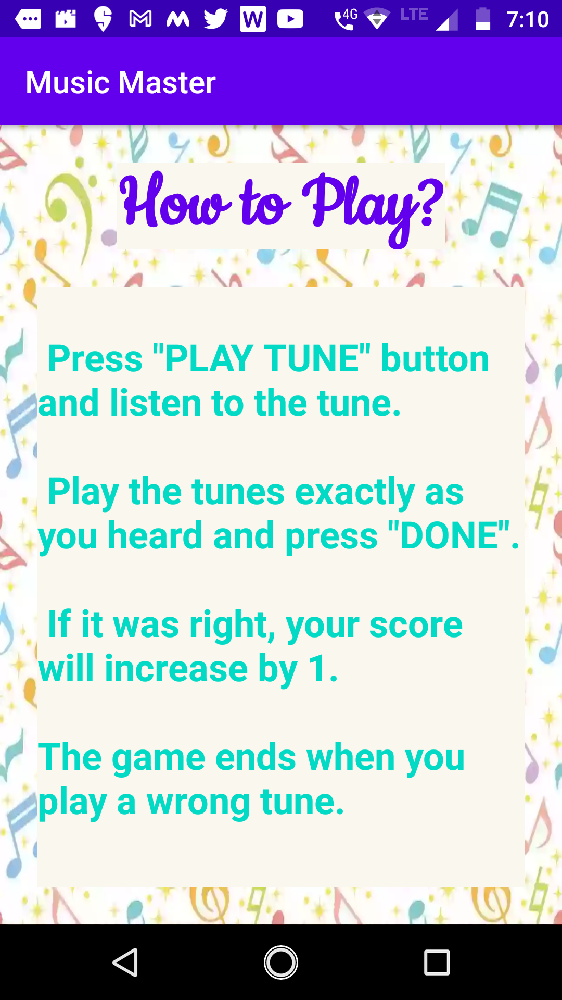
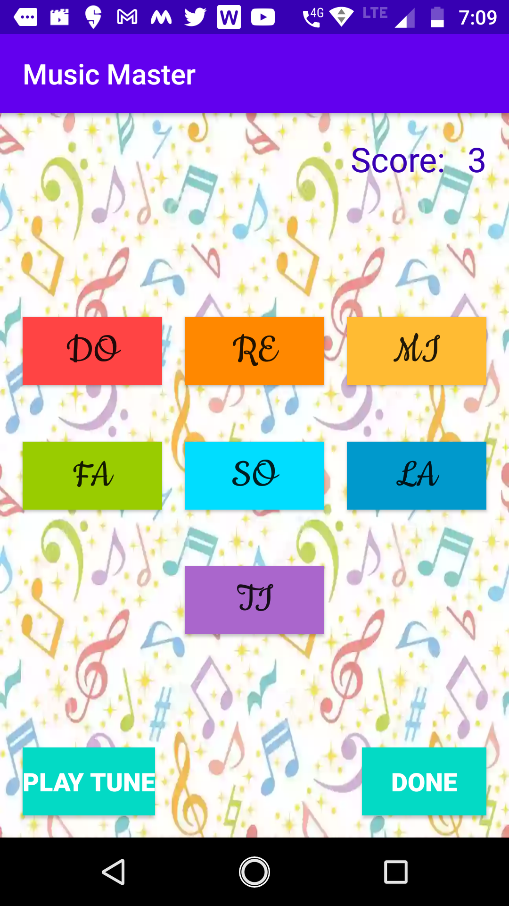
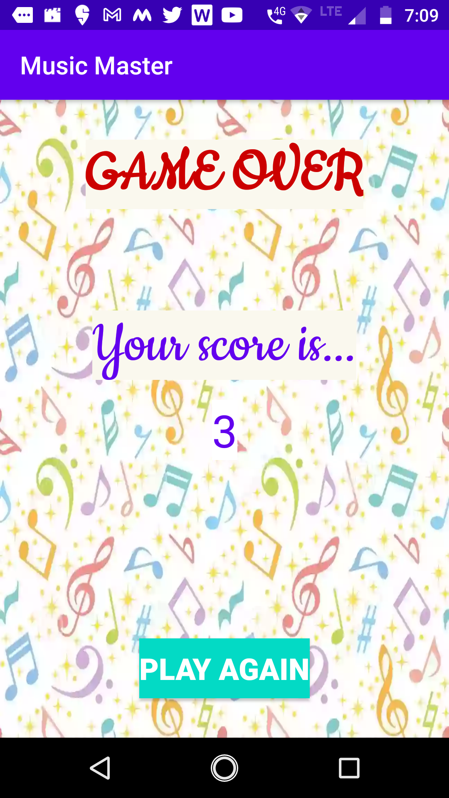

# Music_Master
This is a mobile game created using Kotlin. First, the player has to listen to the musical notes being played. Then the player has to play those notes in the right order. The player gets a point for every round. The game ends when a round is lost.

## Screenshots

